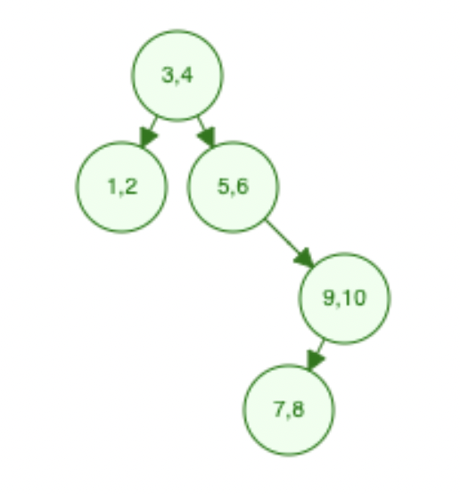

# MS1 Progress Report

Authors:

1. Li Fengyu (fl334)
2. Yolanda Wang (yw583)
3. Chuhan Ouyang (co232)
4. Emerald Liu (sl2322)

## Vision
The vision for our project is still what we had described in MS0, to create a database management system (DBS) that stores data and supports basic SQL queries. Our system supports users to create and drop tables, insert, and update an entry in the table, read input and create an output. To be specific, it supports CRUD (Create, Read, Update, Delete) operations such as SELECT…FROM…WHERE, CREATE, DROP, INSERT, UPDATE, DELETE. Detailed description of these operations can be found in "doc/grammar.md". We use REPL (Read-eval-print loop) to allow clients to interact with the DBS. We followed the plan for MS1 strictly that was written in MS0 besides one minor change that our data base will support one data table right now.

## Summary of Progress
During this sprint, we first set up our project with dune and makefile, so we can build our project with "dune build" as we do in the programming assignments (see dune, dune-project, dune-workspace, and Makefile). Then, we worked on implementing the following 5 functionalities. First, we defined the legal grammar and outline the token types for the SQL commands that we support (see Grammar.md). Then, we implemented a tokenizer that turns a string that the user enters into a list of tokens. We also define the various subtypes for a token, such as a command type, binary operator, or a terminal type (see tokenizer.ml).
We also defined the interfaces for our parser, which parses sql commands, and our controller, which reads the parsed sql commands and start manipulating the database (see parser.mli and controller.mli)

After that, we implemented the parser, creating individual functions to due with each of the sql CRUD operations (see parser.ml), and we also created a test suite for our parser (see test/main.ml). To parse conditional expressions in SQL commands, we used a n-ary tree like structure implemented by nested lists (expression type see Etree.m). We created a test suite for the expression tree (see test/expr.ml). We also implemented the data structure that provides indexing for the database as a tree. It supports basic operations such as find, insert, and delete (see tree.ml) We created test suite for the tree (see test/tree.ml)

## Activity Breakdown
- Lee: Implement the tokenizer that extracts tokens from the input text. Implement and test a binary search tree that support all basic operations as well as high-order functions. Approximate hours spend: 9 hours.
- Emerald: Breakdown structures of the project which includes controller and parse. Build WHERE parse that evaluate condition expression that includes AND, OR. Other parser functionality is build upon this evaluation parser whenever WHERE parse is used. WHERE parse takes in condition expression and data check if the data satisfies the condition. Wrote tests to test the implemented functions with glass and black box testing, peer-reviewed for others code, and wrote part of the progress report. Approximate hours spend: 9 hours.
- Yolanda: Serve as the task manager to organize tasks of the project. Set up dune structure of the project. Implement the following core parse methods - parse, parse_query, parse_create, parse_drop, parse_select - and some of the related helper methods. Implement the REPL interface. Implement the structure of Controller.ml for future use, and created dummy printing methods for demo purposes. Approximate hours spent: 12 hours.
- Chuhan: Contributes to discussion of the interfaces for controller and parser. Implemented the parsing functions for insert, delete, and update, and construct helper functions for general use in the parser.  Added tests for these functions. Approximate hours spent: 8 hours.

## Productivity Analysis
As a team, we were productive. During team meetings, we mainly focused on discussing the big ideas for project, specifically the interfaces for parsers, controller, tokens and the implementation for our tree. Then, we worked individually to implement the functions that we are assigned to complete. We accomplished what we planned and our estimates were accurate.

## Scope Grade
### Satisfactory : 40/40
1. Write test cases for parser.
We carefully tested out our parser code with glass box testing. See all files in "test\" for different tests. This includes many tests for the foundation helper functions that are sealed by mli file.
2. Define the grammar of language.
We defined all grammar that's needed to understand our data base. See "doc\Grammar.md" for the work and specification.
3. Implement parser that parses SQL and custom commands with a naive data base.
We successfully implement the parser that is functioning that can take in SQL commands including create, delete, update, select..where, drop, etc. For one example, if given a data table representation such as the following:

| Name    | Gender | Age | FavColor  |
| ------- | ------ | --- | --------- |
| Emerald | Female | 19  | Blue      |
| Chuhan  | Female | 19  | Purple    |
| Yolanda | Female | 18  | White     |
| Lee     | Male   | 19  | LightBlue |

SELECT * WHERE "Gender" = "Female" AND "Age" = 19

will return data that represents the following:
| <!-- --> | <!-- --> | <!-- --> | <!-- --> |
| -------- | -------- | -------- | -------- |
| Emerald  | Female   | 19       | Blue     |
| Chuhan   | Female   | 19       | Purple   |

### Good : 40/40
There are two tasks for good scope.

1. Write a test suite for the data structure that provides indexing.

We carefully tested the "tree.ml" file which is a data structure that provides
indexing into the database (see test/tree.ml). The testing file contains
functions to generate a sample tree and tests for method such like
get, insert, and delete.

2. Implement a data structure that provides indexing for the database. Most likely be a tree. It should support basic operations such as find and insert. More operations are pending a better understanding of a database’s internal representation.

The data structure is implemented as a tree. The tree support functions 
of to return the values associated with a key in the tree, calculating the size
of the tree, inserting a new key value pair, deleting a node, return an inorder
representation of the node, constructing an empty tree, and fold the tree.

For example, suppose we generate a tree from the list
[ (3, 4); (1, 2); (5, 6); (9, 10); (7, 8) ]
The tree representation would be visually look like the following:

If we traverse the tree inorder, the result will be [ (1, 2); (3, 4); (5, 6); (7, 8); (9, 10)]. 

### Excellent: 20/20
There is one task for excellent scope.

1. Implement a REPL command-line interface and connect it to the parser. The interface can be built in a similar way as the one in A2. It will ask for commands and then call parser methods. For the purpose of the demo, swiftly implement a printing method to visualize the parsed input i.e. the syntax tree.

We did implement a REPL for the user to interact with the parser (see main.ml) The REPL
first greets the user with hello world, and then it prompts the user to start using the database. The user can enter parsing commands for now.

## Goals for the Next Sprint
In MS2 we plan to accomplish the following:
1. (Satisfactory) Implement internal representation of data, and achieve storing data in a file on the hard drive.
2. (Good) Implement database CRUD operations using the indexing data structure and the internal representation.
3. (Excellent) Connect the command line interface and the parser to the database to demo database operations easier.